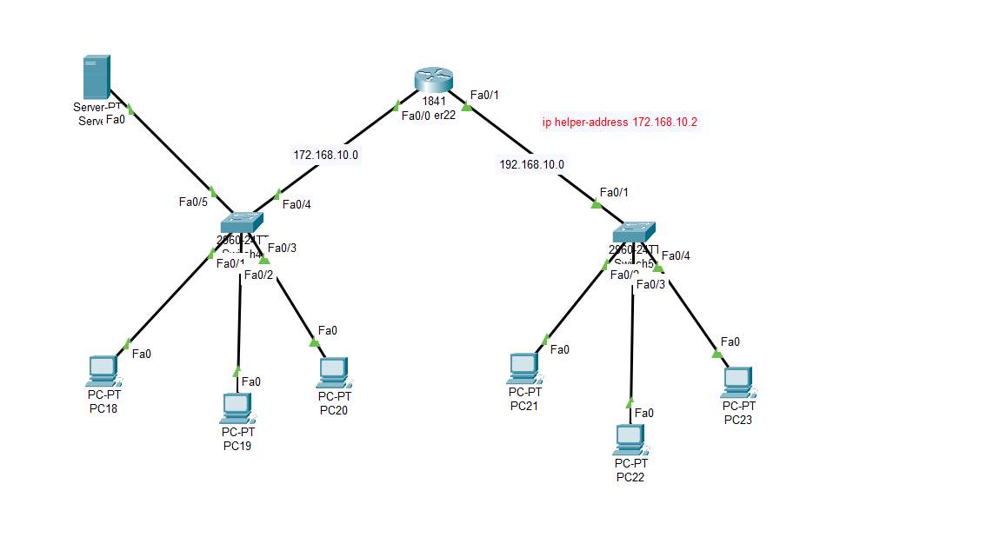

# Computer Network Practicals

| Table of Contents |
| :--: |
| [Static Routing](#static-routing) |
| [RIP Routing](#rip-routing) |
| [OSPF Routing (Single Area)](#ospf-routing-single-area) |
| [OSPF Routing (Multi Area)](#ospf-routing-multi-area) |
| [DHCP Server](#dhcp-routing) |
| [DNS Server](#dns-routing) |

## Static Routing

### Base Command - `ip route <destination_network> <subnet_mask> <next_hop_Address>`

where: 
- `<destination_network>` => The network Address of the link connected recieving PC. It must end in a `0`. eg: (192.168.0.0)
- `subnet_mask` => The Subnet mask of the `<destination_network>`
- `Next_Hop_Address` => The Address of the recieving end of the router.

In below Example, If setting up Static Routing for Left Router (R1) the command would be following: 
```md
Router> en
Router# conf t
Router(config)# ip route 10.0.0.0 255.0.0.0 192.168.0.2
```

</img>

## RIP Routing

### Base Command - `router rip`, `network <network_address>`

where: 
- `<network_address>` => The networks the current router is connected to. It must end in a `0`. eg: (172.16.0.0).

Example, if setting up RIP Routing for Top Left Router (R1) the Commands would be as follows:
```md
Router> en
Router# conf t
Router(config)# router rip
Router(config-router)# network 10.0.0.0
Router(config-router)# network 20.0.0.0
exit
```
</img>

## OSPF Routing (Single Area)

### Base Command - `router ospf 1`, `network  <network_address> <Wildcard_subnet_mask> <area>`

where: 
- `<network_address>` => The networks the current router is connected to. It must end in a `0`. eg: (172.16.0.0).
- `<Wildcard_subnet_mask>` => The inverse of Subnet mask of `<network_address>`. Eg. subnet mask - `255.0.0.0`, its wildcard is - `0.255.255.255`
- `<area>` -> The local area of the network. (`area 0` for Single Area OSPF.) 

Example, If setting up Single Area OSPF for Left Router (R1). The commands would be as follow:
```md
Router> en
Router# conf t
Router(config)# router ospf 1
Router(config)# network 192.168.1.0 0.0.0.255 area 0
Router(config)# network 10.0.0.0 0.255.255.255 area 0
```
</img>

## OSPF Routing (Multi Area)

### Base Command - `router ospf 1`, `network <network_address> <Wildcard_subnet_mask> <area>`

where: 
- `<network_address>` => The networks the current router is connected to. It must end in a `0`. eg: (192.168.0.0).
- `<Wildcard_subnet_mask>` => The inverse of Subnet mask of `<network_address>`. Eg. subnet mask - `255.255.255.0`, its wildcard is - `0.0.0.255`
- `<area>` -> The local area of the network.

Example, If setting up Multi Area OSPF for Topmost Router (R1). The commands would be as follow:
```md
Router> en
Router# conf t
Router(config-if)#router ospf 1
Router(config-router)# network 10.0.0.0 0.255.255.255 area 1
Router(config-router)# network 20.0.0.0 0.255.255.255 area 2
Router(config-router)# network 30.0.0.0 0.255.255.255 area 3
Router(config-router)# network 70.0.0.0 0.255.255.255 area 0
Router(config-router)# exit
```
And for Left Router (R2). The commands will be as follows:
```md
Router> en
Router# conf t
Router(config-if)# router ospf 1
Router(config-router)# network 10.0.0.0 0.255.255.255 area 1
Router(config-router)# network 40.0.0.0 0.255.255.255 area 1
Router(config-router)# exit
```
</img>


## DHCP Routing

#### Base Command - `ip helper-address <DHCP_server_ip_address>`
where:
- `<DHCP_server_ip_address>`=> The Static IP Address of the DCHP Server.

Example, if setting up DHCP for the topology below. Commands for Router:
```md
router> en
router# conf t
router# int fa0/0
router# ip address 172.168.10.1 255.255.0.0
router# int fa0/1
router# ip address 192.168.10.1 255.255.0.0
router# ip helper-address 172.168.10
router# exit
```
Then set up server pool for both the networks in DHCP Server.

</img>

## DNS Routing